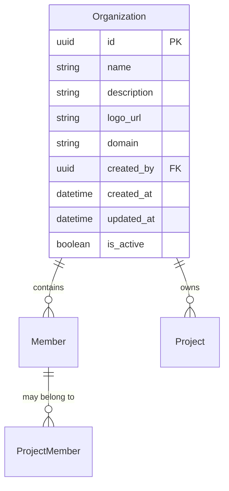

# Organization

## 説明

Organization（組織）は、最上位のグループの単位で、複数のプロジェクトや複数のユーザーが所属します。

## テーブルの関係性

## カラム

### id

- 型: uuid
- 説明: ID
- 例: `123e4567-e89b-12d3-a456-426614174000`

### name

- 型: string
- 説明: 名前
- 例: `My Organization`

### description

- 型: string
- 説明: 説明
- 例: `My Organization is a company that makes products for the web.`

### logo_url

- 型: string
- 説明: ロゴのURL
- 例: `https://example.com/logo.png`

### domain

- 型: string
- 説明: ドメイン
- 例: `example.com`

### created_by

- 型: uuid
- 説明: 作成者のID
- 例: `123e4567-e89b-12d3-a456-426614174000`

### created_at

- 型: datetime
- 説明: 作成日時
- 例: `2021-01-01 00:00:00`

### updated_at

- 型: datetime
- 説明: 更新日時
- 例: `2021-01-01 00:00:00`

### is_active

- 型: boolean
- 説明: アクティブかどうか
- 例: `true`
