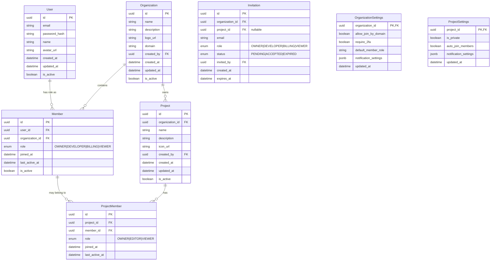

# データベースのスキーマの全体図

```mermaid
erDiagram
  User ||--o{ Member : "has role as"
  Organization ||--o{ Member : "contains"
  Organization ||--o{ Project : "owns"
  Member ||--o{ ProjectMember : "may belong to"
  Project ||--o{ ProjectMember : "has"

  User {
    uuid id PK
    string email
    string password_hash
    string name
    string avatar_url
    datetime created_at
    datetime updated_at
    boolean is_active
  }

  Organization {
    uuid id PK
    string name
    string description
    string logo_url
    string domain
    uuid created_by FK
    datetime created_at
    datetime updated_at
    boolean is_active
  }

  Member {
    uuid id PK
    uuid user_id FK
    uuid organization_id FK
    enum role "OWNER|DEVELOPER|BILLING|VIEWER"
    datetime joined_at
    datetime last_active_at
    boolean is_active
  }

  Project {
    uuid id PK
    uuid organization_id FK
    string name
    string description
    string icon_url
    uuid created_by FK
    datetime created_at
    datetime updated_at
    boolean is_active
  }

  ProjectMember {
    uuid id PK
    uuid project_id FK
    uuid member_id FK
    enum role "OWNER|EDITOR|VIEWER"
    datetime joined_at
    datetime last_active_at
  }

  Invitation {
    uuid id PK
    uuid organization_id FK
    uuid project_id FK "nullable"
    string email
    enum role "OWNER|DEVELOPER|BILLING|VIEWER"
    enum status "PENDING|ACCEPTED|EXPIRED"
    uuid invited_by FK
    datetime created_at
    datetime expires_at
  }

  OrganizationSettings {
    uuid organization_id PK,FK
    boolean allow_join_by_domain
    boolean require_2fa
    string default_member_role
    jsonb notification_settings
    datetime updated_at
  }

  ProjectSettings {
    uuid project_id PK,FK
    boolean is_private
    boolean auto_join_members
    jsonb notification_settings
    datetime updated_at
  }
```
